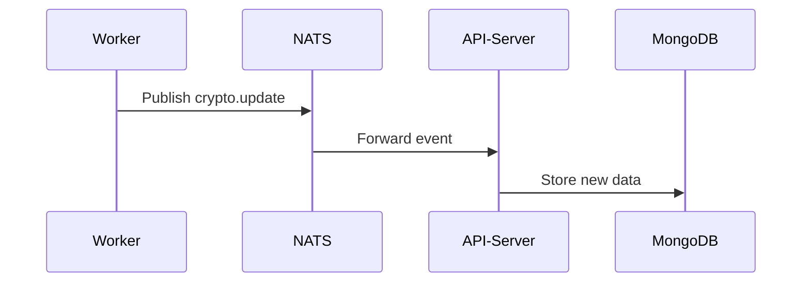

# Worker Server (Background Service)  
## **Event-Driven Crypto Data Collector**  
## 📌 Overview  
The worker server is a standalone Node.js service that:  
1. **Automatically fetches** cryptocurrency data every 15 minutes  
2. **Publishes events** via NATS messaging system  
3. Triggers updates in the main API server through event-driven architecture  

---

## 🔧 Technologies Used  
- **Runtime**: Node.js  
- **Scheduling**: `node-schedule`  
- **Messaging**: NATS (with Docker)  
- **Environment**: Docker Container  

---

## ⚙️ Core Functionality  

### Scheduled Job  
```javascript
schedule.scheduleJob('*/15 * * * *', () => {
  nats.publish('crypto.updates', {
    event: 'CRYPTO_UPDATE',
    timestamp: new Date().toISOString() 
  });
});
```

### Event Payload  
```json
{
  "event": "CRYPTO_UPDATE",
  "timestamp": "2023-11-21T14:30:00Z"
}
```

---

## 🚀 Getting Started  

### 1. Prerequisites  
- Docker installed and running  
- NATS server accessible (default: `nats://localhost:4222`)  
- API server subscribed to `crypto.updates` channel  

### 2. Installation  
```bash
git clone https://github.com/LikhithPalya/KoinX-assignment.git
cd worker-server
npm install
```

### 3. Configuration (`.env`)  
```env
NATS_URL=nats://localhost:4222
LOG_LEVEL=debug # Optional
```

### 4. Running the Service  
**Development Mode:**  
```bash
npm run dev
```

**Production Mode:**  
```bash
docker build -t worker-server .
docker run -d --network host worker-server
```

---

## 📂 Project Structure  
```
worker-server/
├── services/
│      └── nats.js       # NATS client wrapper     
├──index.js 
|         # Entry point  
├── .env.example  
└── package.json
```

---

## 🔍 Monitoring & Logs  

### Expected Output  
```
[NATS] Connected to nats://localhost:4222
[CRON] Scheduled job initialized (every 15 minutes)
[PUBLISH] Sent crypto.update event at 14:30:00
```

### Docker containers
| Step             | Command or Action                                           |
| ---------------- | ----------------------------------------------------------- |
| Launch Docker    | Open Docker Desktop                                         |
| Check Docker     | `docker --version`                                          |
| Test Docker      | `docker run hello-world`                                    |
| Run NATS Server  | `docker run -d -p 4222:4222 --name nats-server nats:latest` |
| Check Container  | `docker ps`                                                 |
| Stop Container   | `docker stop nats-server`                                   |
| Remove Container | `docker rm nats-server`                                     |

---

---

## ⚠️ Troubleshooting  

| Error | Solution |
|-------|----------|
| `NATS CONNECTION_REFUSED` | Verify NATS server is running (`docker ps`) |
| `Invalid event format` | Check payload schema in `cryptoJob.js` |
| `Missed schedules` | Confirm system timezone is correct |

---

## 🌐 Inter-Service Communication  



---

## 🛠️ Production Deployment  

### Docker Compose Example  
```yaml
services:
  worker:
    build: ./worker-server
    env_file: .env
    depends_on:
      - nats
    restart: unless-stopped
```

---

## 📈 Scaling Options  
1. **Horizontal Scaling**: Run multiple worker instances  
2. **Priority Queues**: Use NATS queue groups  
3. **Backpressure Handling**: Implement request throttling  

---

## ✅ Verification Checklist  
- [ ] NATS connection established  
- [ ] Events appear in API server logs  
- [ ] No missed schedules in 24h test  
- [ ] Proper error recovery on disconnects  

---

## 📜 License  
MIT © 2023 Your Name  

[](https://nats.io)
